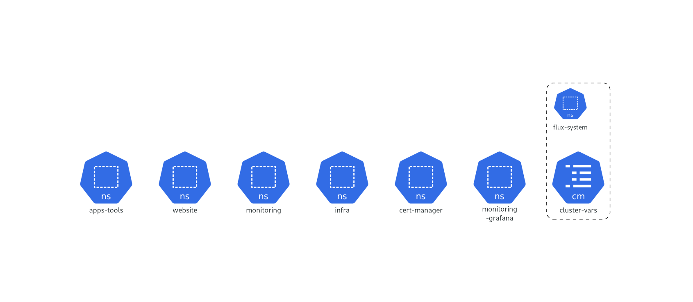

   

  
  
  
  

# TerraInfra

Infra for Devsh (k3s on Scaleway) with GitOps via Flux.

Branches:
- `env/prod` → production cluster (kept up, do not destroy)
- `env/test` → ephemeral/test cluster (can be recreated on demand)

> [!WARNING]
> Pushing to `env/prod` reconciles the live production cluster. Read `docs/environments.md` and `docs/getting-started.md` before changing prod.

Docs live in `docs/`:
- `docs/getting-started.md` – prerequisites, tooling, `.env` template, age key, GitOps flow
- `docs/environments.md` – prod/test branches & workspaces
- `docs/how-to-commit.md` – fast-forward workflow (test → prod)
- `docs/secrets.md` – SOPS/age secrets: create/encrypt/decrypt
- `docs/snapshots.md` – prod snapshot workflow & restore to test
- `docs/dns.md` – DNS (manual for now)
- `docs/security.md` – hardening matrix, how to add services with current security baseline
- `docs/ui.md` – Kubernetes Dashboard (read-only) access
- `docs/monitoring.md` – Grafana dashboard provisioning and updates
- `docs/alerts.md` – alerting flow (Alertmanager → OnCall → Discord) + smoke tests
- `docs/resources.md` – resource requests/limits, priority classes, uptime notes
- `docs/ci.md` – CI checks and generated files

Generated by CI (do not edit manually):
- `terraform/TERRAFORM.md` - Terraform inputs/outputs/module docs
- `terraform/snapshots/TERRAFORM.md` - Terraform docs for the snapshots root
- `terraform/iam/TERRAFORM.md` - Terraform docs for IAM + bucket policies
- `KUBEDIAGRAM.png` - Kubernetes architecture diagram from manifests

## Diagram

